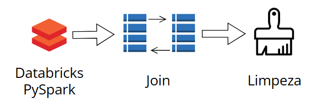
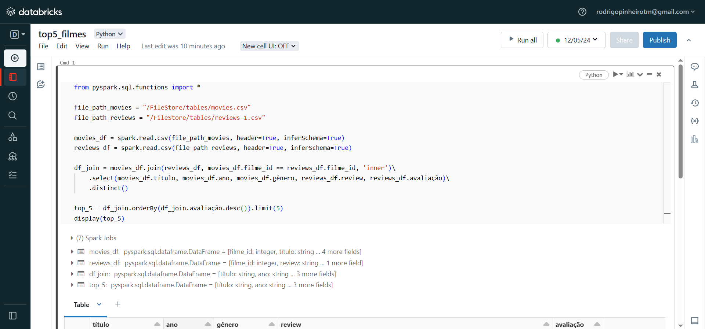
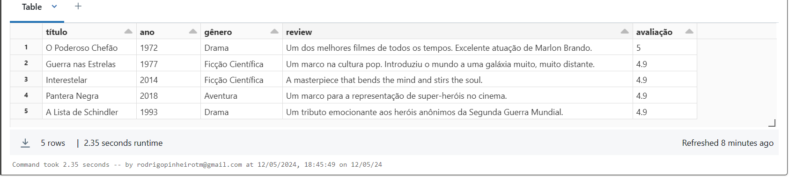

# Análise de Avaliações de Filmes com PySpark

Neste projeto, realizei uma análise das avaliações de filmes utilizando o PySpark no Databricks. Objetivo: extrair insights dos dados e identificar os cinco filmes mais bem avaliados.

_________________________________________________________________________

### Passos Realizados

Carregamento dos Dados: Os dados foram carregados a partir de dois arquivos CSV: um contendo informações sobre os filmes, incluindo título, ano e gênero, e outro contendo avaliações dos usuários para esses filmes.

Junção dos DataFrames: Utilizando a função join do PySpark, uni os dataframes com base na chave "filme_id", garantindo que as avaliações correspondessem aos filmes corretos.

Seleção e Limpeza dos Dados: Foram selecionadas apenas as colunas relevantes para a análise, incluindo: título, ano, gênero, review e avaliação. Além disso, apliquei a função distinct para remover entradas duplicadas e garantir que cada filme aparecesse apenas uma vez nos resultados.

Ordenação e limitação dos resultados: Os resultados foram ordenados com base na coluna de avaliação em ordem descendente e limitados às cinco primeiras entradas, revelando os cinco filmes mais bem avaliados.

### Conclusão:

A análise permitiu identificar os cinco filmes mais bem avaliados pelos usuários com base nas avaliações fornecidas. Esse tipo de análise pode ser útil para recomendação de filmes ou para entender as preferências dos usuários em uma plataforma de streaming.
___________________________________________________________________________________
Você pode verificar o código clicando [aqui](https://github.com/rodrigopinheiro1996/top5-filmes/blob/main/databricks_notebooks_pyspark/pyspark_top5_filmes.py)
